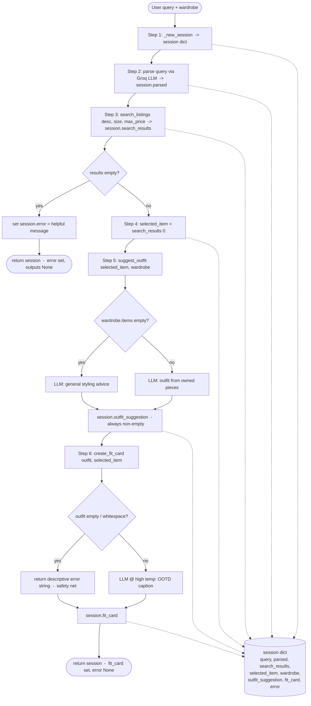

# FitFindr — planning.md

> Complete this document before writing any implementation code.
> Your spec and agent diagram are what you'll use to direct AI tools (Claude, Copilot, etc.) to generate your implementation — the more specific they are, the more useful the generated code will be.
> Your planning.md will be reviewed as part of your submission.
> Update it before starting any stretch features.

---

## Tools

List every tool your agent will use. For each tool, fill in all four fields.
You must have at least 3 tools. The three required tools are listed — add any additional tools below them.

### Tool 1: search_listings

**What it does:**

<!-- Describe what this tool does in 1–2 sentences -->

Search the mock listings dataset for second-hand items that match keyword description, with optional size and price filters on top of that. Each listing is scored based on how well it aligns with the passed in dscription, and then is arranged from best to worst match.

**Input parameters:**

<!-- List each parameter, its type, and what it represents -->

- `description` (str): Keywords describing what the user wants. Score against the title, description, style tags.
- `size` (str): (Or None) size to filter by, is optional as user might not specify a size.
- `max_price` (float): Inclusive price ceiling.

**What it returns:**

A list[dict] of matching strings, sorted by relevance (the best match first). Each dict in the list has an ID, title, description, category, style_tags (list), size, condition, price (float), colors (list), brand, platform.

**What happens if it fails or returns nothing:**

<!-- What should the agent do if no listings match? -->

---

Returns []. Agent checks for this in the planning loop, sets session["error"] to a helpful message and returns early. Pre-emptively stop agent workflow.

### Tool 2: suggest_outfit

**What it does:**

<!-- Describe what this tool does in 1–2 sentences -->

Takes a thrifted item and the user's wardrobe and asks an LLM to suggest 1–2 complete outfits, pairing the new item with named pieces the user already owns. It's a generative tool, not a filter — the styling ideas come from the model, not a lookup.

**Input parameters:**

<!-- List each parameter, its type, and what it represents -->

- `new_item` (dict): Dict. A listing dict (the item the user is considering), typically the top result from search_listings. Provides the title, category, colors and style tags the outfit's built around.
- `wardrobe` (dict): The user's wardrobe: A dict with an items key that holds the list of wardrobe-item dictst. May be empty, which must be handled gracefully.

**What it returns:**

None empty str of outfit suggestions in a natural language. NEVER return an empty string and NEVER raises.

**What happens if it fails or returns nothing:**

<!-- What should the agent do if the wardrobe is empty or no outfit can be suggested? -->

---

If wardrobe["items"] is empty, then the tool will not error. Instead, ask the LLM for general styling advice for the item (what kinds of pieces will pair well, what vibes suited) instead of naming specific wardrobe items. Essentially it's a graceful failure where it improvises and WILL return a recommendation.

### Tool 3: create_fit_card

**What it does:**

<!-- Describe what this tool does in 1–2 sentences -->

Takes the styling suggestion and the thrifted item and asks an LLM to write a short, casual social-media caption for the find — like a real OOTD post, not a product description. Runs at a higher temperature so different inputs produce different-sounding captions.

**Input parameters:**

<!-- List each parameter, its type, and what it represents -->

- `outfit` (...): The outfit suggestion string returned by suggest_outfit. This is the styling content the caption is built from.
- `new_item` (dict): The listing dict for the thrifted item. Supplies the name, price, and platform that get woven into the caption (once each).

**What it returns:**

<!-- Describe the return value -->

A 2–4 sentence str usable as an Instagram/TikTok caption. It mentions the item name, price, and platform naturally, captures the outfit's vibe in specific terms, and reads as authentic rather than salesy.

**What happens if it fails or returns nothing:**

<!-- What should the agent do if the outfit data is incomplete? -->

---

If outfit is empty or whitespace-only, the tool returns a descriptive error-message string rather than raising or calling the LLM (tools.py:128-129). In practice this shouldn't trigger in the happy path, because suggest_outfit always returns a non-empty string — so this guard is a safety net for a malformed or skipped upstream step.

### Additional Tools (if any)

<!-- Copy the block above for any tools beyond the required three -->

---

May potentially implement tools that format the wardrobe or the listing item.

## Planning Loop

**How does your agent decide which tool to call next?**

<!-- Describe the logic your planning loop uses. What does it look at? What conditions change its behavior? How does it know when it's done? -->

---

The planning loop is linear with early-exit guards — not a free-form "pick a tool" loop. It runs a fixed sequence and bails out the moment a step can't produce valid input for the next one. State lives in a single session dict that every step reads from and writes to.

Step 1 — Initialize. Build the session with \_new_session(query, wardrobe). All result fields start empty and session["error"] starts as None.

Step 2 — Parse the query. Extract description, size, and max_price from the natural-language query and store them in session["parsed"]. Size and max_price are optional — if the query states no size, leave it None; if it states no price, leave it None. (Parsing method: an LLM call via the existing Groq client — the query is sent with a prompt asking for a structured `{description, size, max_price}` extraction, which is robust to messy phrasing like "under 30 bucks" or "size medium-ish". The LLM is instructed to return `null` for any field the query doesn't mention.)

Step 3 — Search, then branch on results. Call search_listings(description, size, max_price) and store the list in session["search_results"].

If the list is empty: set session["error"] to a helpful message (e.g., "No listings under $30 matched 'vintage graphic tee'. Try raising the price or loosening the description.") and return the session immediately. Do not call suggest_outfit — its new_item would be invalid.
If the list is non-empty: continue.
Step 4 — Select the item. Set session["selected_item"] = session["search_results"][0] (the top-ranked result, since search_listings returns them sorted best-first).

Step 5 — Suggest an outfit. Call suggest_outfit(selected_item, wardrobe) and store the string in session["outfit_suggestion"]. No branch is needed here: the tool always returns a non-empty string (specific outfits if the wardrobe has items, general styling advice if it's empty), so the loop can always proceed.

Step 6 — Create the fit card. Call create_fit_card(outfit_suggestion, selected_item) and store the string in session["fit_card"].

Step 7 — Return. Return the completed session.

How it knows it's done: the loop terminates either at the early return in Step 3 (no results → error set, output fields stay None) or after Step 7 (success → fit_card populated, error is None). The caller checks session["error"] first to tell the two apart.

## State Management

**How does information from one tool get passed to the next?**

<!-- Describe how your agent stores and accesses state within a session. What data is tracked? How is it passed between tool calls? -->

State lives in a single **session dict**, created by `_new_session(query, wardrobe)` in `agent.py`. There is no global or cross-request state — one dict is created per call to `run_agent()` and is the single source of truth for that interaction. The tools themselves (`search_listings`, `suggest_outfit`, `create_fit_card`) are stateless: they take explicit arguments and return values, and never read or write the session directly. The **planning loop is the only thing that touches the session** — after each tool returns, the loop stores the result in the session and then reads the field it needs to build the next tool's arguments.

**What is tracked (the session fields, from `_new_session`):**

| Field               | Set by                       | Used by                                                     |
| ------------------- | ---------------------------- | ----------------------------------------------------------- |
| `query`             | caller / Step 1              | Step 2 (parsing)                                            |
| `parsed`            | Step 2 (LLM extraction)      | Step 3 — `description`, `size`, `max_price` for the search  |
| `search_results`    | Step 3                       | Step 4 (select), and the empty-check that branches to error |
| `selected_item`     | Step 4 (`search_results[0]`) | Step 5 (`new_item`) and Step 6 (`new_item`)                 |
| `wardrobe`          | caller / Step 1              | Step 5 (`suggest_outfit`)                                   |
| `outfit_suggestion` | Step 5                       | Step 6 (`create_fit_card`)                                  |
| `fit_card`          | Step 6                       | final output to user                                        |
| `error`             | any step on early exit       | caller — checked first to distinguish success vs. failure   |

**How data is passed between tools:** the loop threads it explicitly. `search_results[0]` becomes `selected_item`, which is passed as `new_item` into `suggest_outfit`; that returns `outfit_suggestion`, which is passed alongside `selected_item` into `create_fit_card`. Nothing is passed implicitly — every hand-off is a field written to the session and then read back out, so the full state of any run can be inspected by printing the session dict.

---

## Error Handling

For each tool, describe the specific failure mode you're handling and what the agent does in response.

| Tool            | Failure mode                          | Agent response                                                                                                                                                                                                                                                                                                                                                                                                                     |
| --------------- | ------------------------------------- | ---------------------------------------------------------------------------------------------------------------------------------------------------------------------------------------------------------------------------------------------------------------------------------------------------------------------------------------------------------------------------------------------------------------------------------- |
| search_listings | No results match the query            | Tool returns `[]` (never raises). The loop detects the empty list in Step 3, sets `session["error"]` to a specific, actionable message (e.g. "No listings under $30 matched 'vintage graphic tee'. Try raising the price or loosening the description.") and **returns the session immediately** — it does not call `suggest_outfit`, whose `new_item` would otherwise be invalid. `outfit_suggestion` and `fit_card` stay `None`. |
| suggest_outfit  | Wardrobe is empty                     | Not treated as an error — the tool checks `wardrobe["items"]` and, if empty, switches its prompt to ask the LLM for **general styling advice** (what kinds of pieces and vibes pair with the item) instead of naming owned pieces. It always returns a non-empty string, so the loop proceeds normally to Step 6.                                                                                                                  |
| create_fit_card | Outfit input is missing or incomplete | The tool guards against an empty / whitespace-only `outfit` string and returns a **descriptive error-message string** rather than raising or calling the LLM. This is a safety net: in the happy path it never fires, because `suggest_outfit` always returns a non-empty string.                                                                                                                                                  |

**Cross-cutting failures (LLM/API):** any unexpected exception from a Groq call (network error, missing/invalid `GROQ_API_KEY`, rate limit) is allowed to surface as a clear error rather than being silently swallowed — `_get_groq_client()` already raises a descriptive `ValueError` when the key is unset. The three failure modes above are the _expected, designed-for_ ones the agent recovers from gracefully.

---

## Architecture

<!-- Draw a diagram of your agent showing how the components connect:
     User input → Planning Loop → Tools (search_listings, suggest_outfit, create_fit_card)
                                                                          ↕
                                                                   State / Session
     Show what triggers each tool, how state flows between them, and where error paths branch off.
     ASCII art, a Mermaid diagram (https://mermaid.js.org/syntax/flowchart.html), or an embedded
     sketch are all fine. You'll share this diagram with an AI tool when asking it to implement
     the planning loop and each individual tool. -->

The planning loop is the spine: it owns the session and calls the tools left-to-right. Two branch points (empty search results, empty wardrobe) and one guard (empty outfit) are where the error paths live. The session sits beside the loop — every step reads from and writes to it.

---

Mermaid screenshot:

## AI Tool Plan

<!-- For each part of the implementation below, describe:
     - Which AI tool you plan to use (Claude, Copilot, ChatGPT, etc.)
     - What you'll give it as input (which sections of this planning.md, your agent diagram)
     - What you expect it to produce
     - How you'll verify the output matches your spec before moving on

     "I'll use AI to help me code" is not a plan.
     "I'll give Claude my Tool 1 spec (inputs, return value, failure mode) and ask it to implement
     search_listings() using load_listings() from the data loader — then test it against 3 queries
     before trusting it" is a plan. -->

**Milestone 3 — Individual tool implementations:**

**Tool I'll use:** Claude (Claude Code), since the tool specs in this doc are detailed enough to drive code generation directly. I'll implement the three tools **one at a time**, in dependency order (`search_listings` → `suggest_outfit` → `create_fit_card`), testing each in isolation before the next.

- **`search_listings`** — Input to Claude: the Tool 1 spec (inputs, return shape, the "returns `[]`, never raises" failure mode) plus the `load_listings()` signature from `utils/data_loader.py` and the listing field list. Expected output: a function that loads listings, filters by `size`/`max_price`, scores remaining items by keyword overlap with `description`, drops zero-score items, and returns them sorted best-first. **Verify before trusting:** run 3 queries — (1) "vintage graphic tee" → relevant tees ranked first; (2) a query with `size="M"` + `max_price=30` → confirm both filters apply; (3) "designer ballgown size XXS under $5" → returns `[]`. Eyeball the top-3 scores on query 1 for sane ranking.
- **`suggest_outfit`** — Input to Claude: the Tool 2 spec, the wardrobe dict shape (`items` list), and the empty-wardrobe requirement. Expected output: a function that branches on `wardrobe["items"]` — specific outfits when populated, general styling advice when empty — and always returns a non-empty string. **Verify:** call once with `get_example_wardrobe()` (should name real owned pieces) and once with `get_empty_wardrobe()` (should give general advice, never crash, never empty).
- **`create_fit_card`** — Input to Claude: the Tool 3 spec, including the empty-outfit guard and the caption style rules (casual, mentions name/price/platform once each, higher temperature). Expected output: a guard that returns an error string for empty input, otherwise an LLM-generated 2–4 sentence caption. **Verify:** call with a real `outfit` string + a listing dict (caption mentions name/price/platform, reads casual); call with `""` (returns the descriptive error string, no LLM call); call twice with the same input at high temp (captions differ).

**Milestone 4 — Planning loop and state management:**

**Tool I'll use:** Claude (Claude Code). Input to Claude: the **Planning Loop**, **State Management**, **Error Handling**, and **Architecture** sections above (the Mermaid diagram especially), plus the `_new_session()` field list and the three tested tool signatures. Expected output: `run_agent()` implementing the 7-step sequence — initialize session, LLM-parse the query into `session["parsed"]`, search, **early-return on empty results with `session["error"]` set**, select top item, suggest outfit, create fit card, return the session. State must be threaded only through the session dict (no globals), matching the State Management table.

**Verify before trusting:** run three end-to-end paths and inspect the returned session — (1) **happy path** ("vintage graphic tee under $30" + example wardrobe) → `error is None`, `selected_item`/`outfit_suggestion`/`fit_card` all populated; (2) **no-results path** ("designer ballgown size XXS under $5") → `error` is a helpful string and `outfit_suggestion`/`fit_card` are still `None` (proves the early return fired before `suggest_outfit`); (3) **empty-wardrobe path** (happy query + `get_empty_wardrobe()`) → completes with a general-advice outfit and a valid fit card. The `__main__` block in `agent.py` already exercises paths (1) and (2), so I'll run `python agent.py` and add the empty-wardrobe case.

---

## A Complete Interaction (Step by Step)

Write out what a full user interaction looks like from start to finish — tool call by tool call. Use a specific example query.

**Example user query:** "I'm looking for a vintage graphic tee under $30. I mostly wear baggy jeans and chunky sneakers. What's out there and how would I style it?"

**Step 1:**

<!-- What does the agent do first? Which tool is called? With what input? -->

Based on the input and what it's asking for, it would appear that it wants the agent to execute search_listings(). That gets the listings objects that contain the word "tee" as well as going to the style tag and filter the ones that say "vintage" and "graphic tee". Finally, look at the prices, filter out the ones that are $30 and under and retrieve the top pick. A potential failure case would be if the specific article of clothing (top, bottom) can't be mapped, or if there is no such item that can meet the price requirement. My thought process would be to make the tool look for clothing "close enough" as a fallback.

**Step 2:**

<!-- What happens next? What was returned from step 1? What tool is called now? -->

The output from step 1 was the top pick of the requested listings item. Next, the user will pass in the vintage graphic tee as new_item variable and pass the user's current wardrobe in the function suggest_outfit() (so if I haven't configured a wardrobe it'd then go to get_empty_wardrobe). Filter out the other parameters for "I mostly wear baggy jeans and chunky sneakers" and then look through what in the user's wardrobe align with those items (based on the instructions it looks like currently takes in wardrobes, so I may need to make modifications to look through what clothes the user specified in their wardrobe). If no such items exist, go to a fallback of finding the next closest item.

**Step 3:**

<!-- Continue until the full interaction is complete -->

Output of suggest_outfit() is used in the tool call to create_fit_card() along with the tee the user had been recommended. Will generate a final card. This suggest_outfit() running would be dependent on if the previous 2 steps were successful.

**Final output to user:**

<!-- What does the user actually see at the end? -->

"thrifted this faded band tee off depop for $22 and honestly it was made for my wide-legs 🖤 full look in my stories". Depends on if step 3 was successful.
